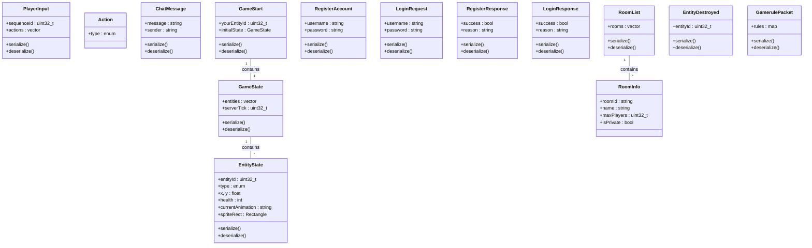

# DTO (Data Transfer Object) Diagram

---

## Legend
- **DTOs**: Data structures for protocol messages
- **serialize/deserialize**: Methods for binary conversion
- **Relationships**: Aggregation (contains)
