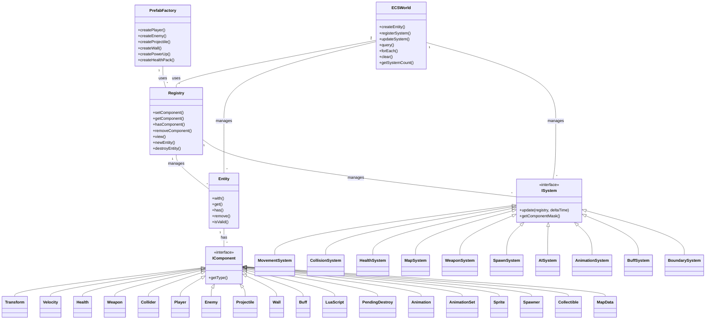

# ECS UML Diagram

---

## Legend
- **Registry**: Manages entities and components
- **Entity**: Holds components
- **IComponent**: Base interface for all components
- **ISystem**: Base interface for all systems
- **PrefabFactory**: Creates entities with predefined components
- **ECSWorld**: High-level ECS manager (server-side)
- **Systems**: Operate on entities with specific component combinations
- **Components**: Data attached to entities
