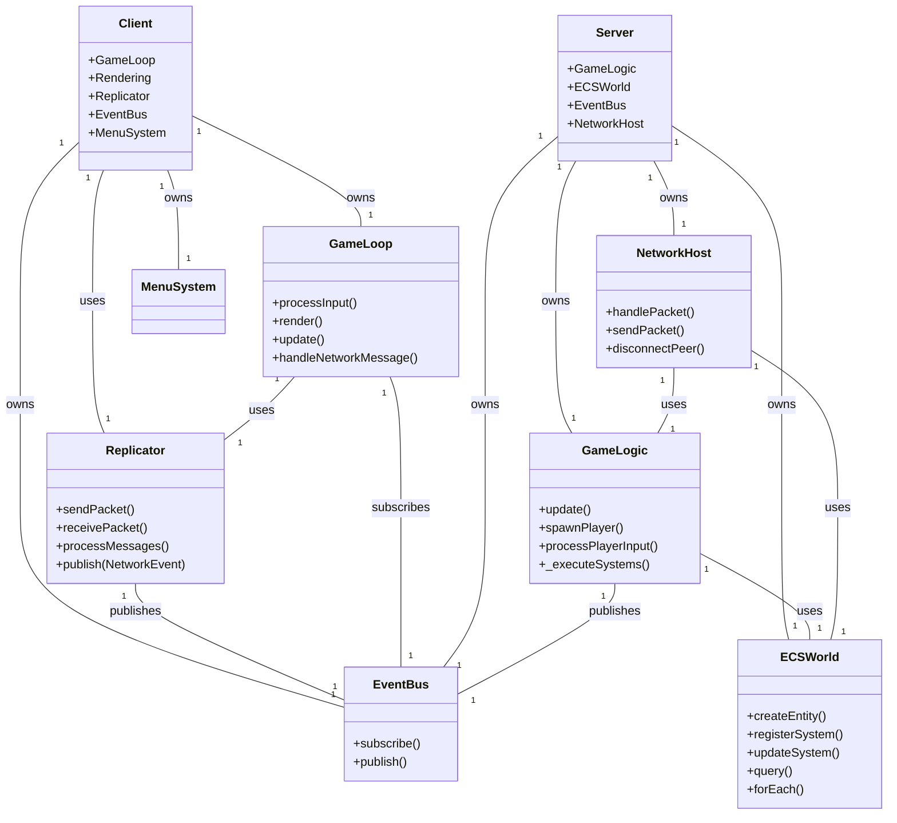

# Linking Diagram (UML)

---

## Legend
- **Client**: Game client, owns GameLoop, Replicator, EventBus, MenuSystem
- **Server**: Game server, owns GameLogic, ECSWorld, EventBus, NetworkHost
- **Replicator**: Handles network packets, publishes events
- **GameLoop**: Main loop, processes input, rendering, network
- **GameLogic**: Server-side game logic, manages ECS
- **ECSWorld**: ECS manager, entity/system registry
- **EventBus**: Event system for decoupled communication
- **NetworkHost**: Network server, handles packets and connections
