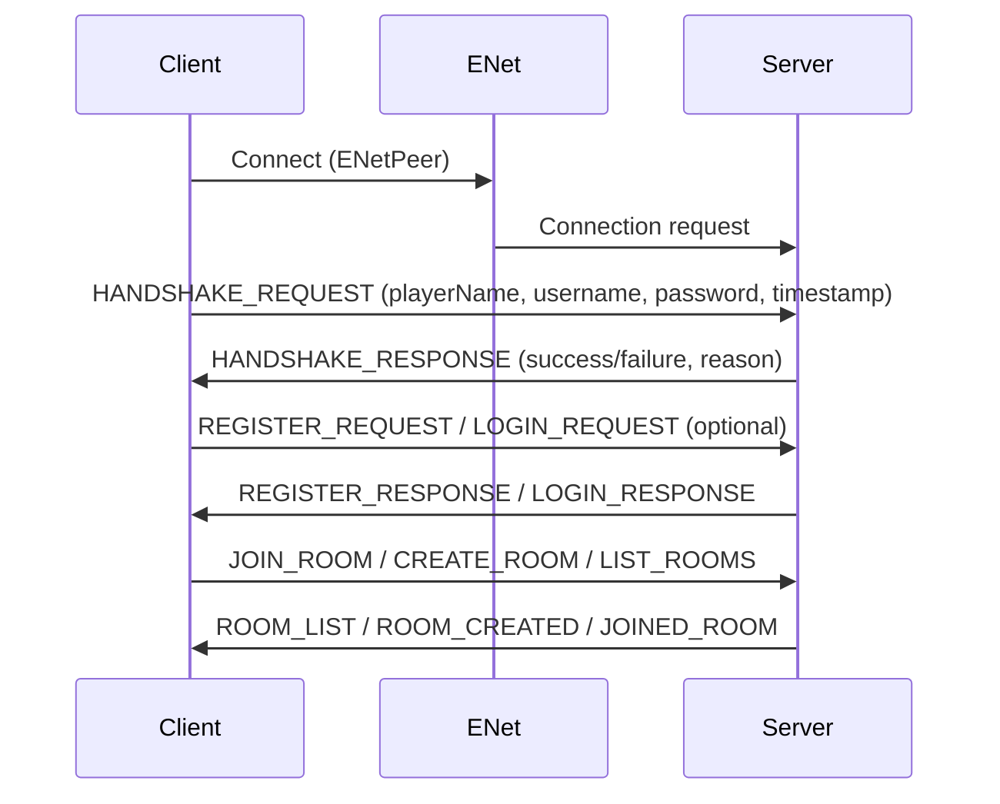
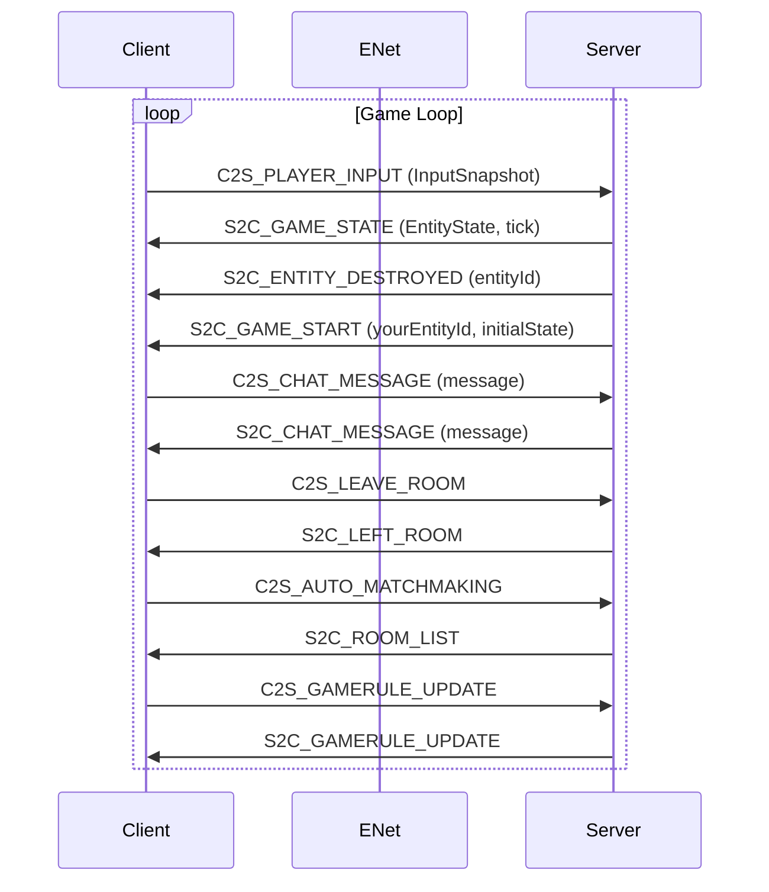

# Protocol UML Diagrams

## 1. Connection Setup (Handshake)

---

## 2. Runtime Exchanges (Game Loop)

---

## Legend
- **C2S**: Client to Server
- **S2C**: Server to Client
- **ENet**: Network transport layer
- **Handshake**: Initial authentication and setup
- **Game Loop**: Real-time gameplay packet exchange
- **Room Management**: Room creation, joining, listing
- **Chat**: In-game chat messages
- **Gamerule**: Game rule updates
